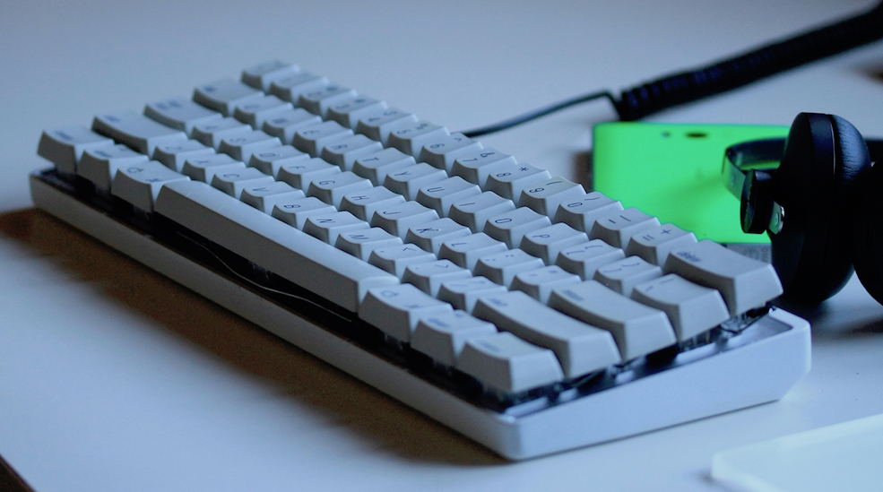
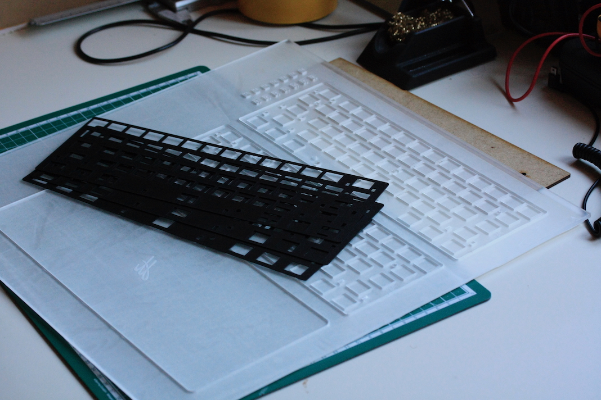
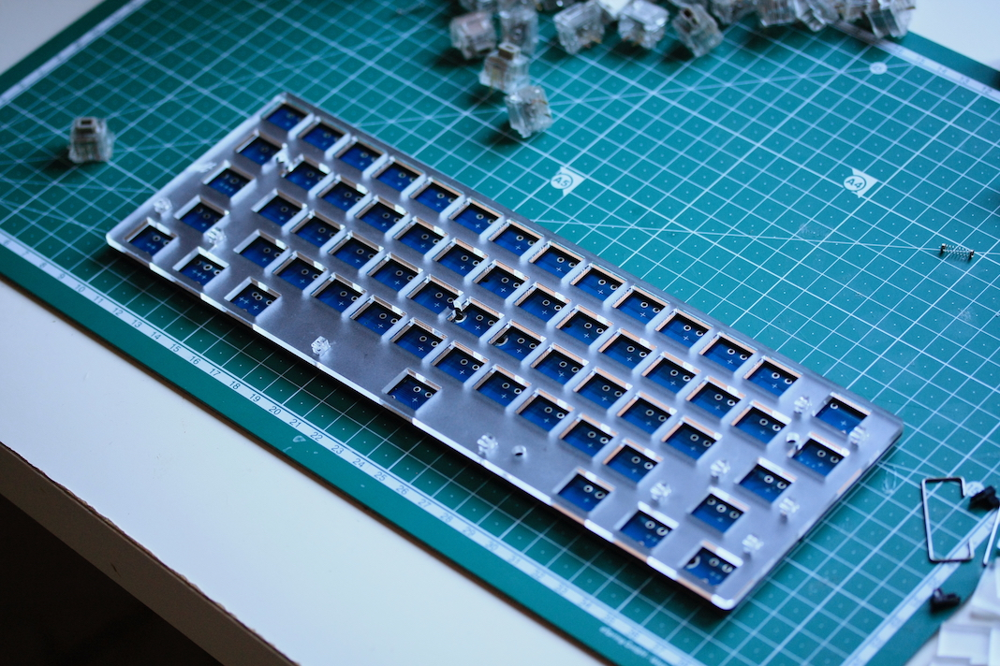
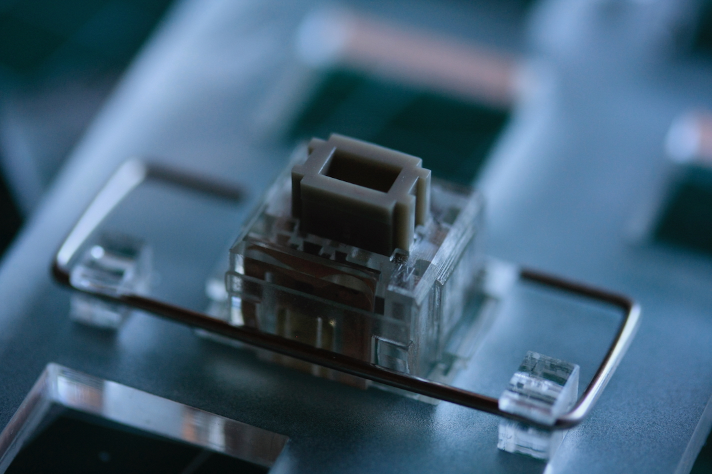

# Drawings for a 60% Apple Extended Keyboard plate

In this repository you find the design files in `.svg` format for a thick 60% Apple Extended Keyboard plate. It's only designed to fit the ANSI layout.

A build log of my keyboard can be found [here](https://imgur.com/gallery/N0n8I)

In contrast to normal 1.2mm thin Alps plates, this was designed with thicker acrylic/aluminium/etc plates in mind. Since the clips for the original stablisers wouldn't fit, these designs come with their own stabiliser clips with fitting cutouts for the original wires.

The current design expects the stabiliser clips to be made from **3mm** thick material.

## Example

For my keyboard I used _one_ 3mm thick acrylic, and _two_ 0.8mm polypropylen plates. This makes the whole plate about 4.6mm thick, perfect for ALPS switches.

Here are closeups of the plate and the stabilisers

## Disclaimer

Since the kerf from every (laser) machine is different, I take no responsibility for a perfect fit with these drawings. Please modify the drawings accordingly.
